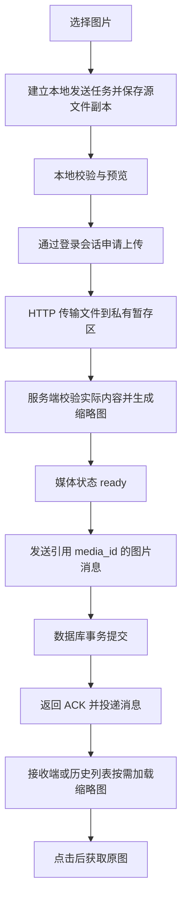

# 聊天图片功能：学习与实施计划

更新时间：2026-09-17。目标是让 tianmu_sama 能理解、实现、验证和维护完整的图片消息链路。沿用 Electron 客户端、C++ 图片核心、MySQL 元数据、开发阶段磁盘存储、后续 OSS 联调的方案。

## 当前起点

| 部分 | 当前状态 |
|---|---|
| C++ 图片核心 | 已实现并测试 JPEG/PNG 校验、尺寸限制、EXIF 方向、透明度和缩略图 |
| 磁盘对象存储 | 已实现并测试暂存、限额、不可变发布和路径约束 |
| 数据库 | 增量迁移及媒体仓储已通过真实 MySQL 测试，尚未应用到业务库 |
| Electron | 图片子进程调用模块已测试；图片任务、界面、历史加载尚未接入 |
| 网络与业务 | 图片控制协议、文件上传下载、图片消息投递尚未接入 |
| 运行环境 | WSL2 已可编译和测试；现有聊天服务部署在远程 6000，图片功能尚未发布 |

原实现清单保持 4/14 完成。已有代码是学习材料和可复用基础，不把独立模块通过测试当成整个功能完成。

## 先掌握完整链路

文件传完、服务端验证完成、消息入库、对方收到、对方读过，是不同事件。第一版以“消息事务已提交并收到 ACK”定义发送成功；已读回执另行设计。

三个标识必须分清：`request_id` 对应一次请求和回应；`client_msg_id` 对应一次逻辑发送，重试不变；`media_id` 对应服务端媒体资源。对象 key 是存储定位，临时下载 URL 是访问凭据，两者不作为消息身份。

## 阶段一：把已有图片核心与数据契约讲透

**学习重点**：编码文件与解码像素的区别；`cv::Mat` 的内存与通道；等比例缩放、JPEG 质量、PNG alpha、EXIF 方向；原图、缩略图和本地预览各自的作用。OpenCV 的 `imdecode`/`imencode` 分别处理内存中的解码和编码，具体行为对照[官方文档](https://docs.opencv.org/4.13.0/d4/da8/group__imgcodecs.html)。Linux 当前使用 4.6，学习和实现须核对已安装版本，不能直接采用较新版本才有的接口。

**代码入口**：[image.h](D:/chat_server/ChatServer/media/include/chat/media/image.h)、[image.cpp](D:/chat_server/ChatServer/media/src/image.cpp)、[image_processor.js](E:/chat_server_qt/ChatClient/chat_client_electron/src/image_processor.js)、[媒体迁移](D:/chat_server/ChatServer/migrations/001_chat_media.sql)。

**产出与验收**：画出数据流、状态转换及三个 ID 的用途；给出一份图片消息和上传描述的字段示例。用旋转 JPEG、透明 PNG、大像素小文件、损坏文件验证当前核心。24 MP 的四通道像素缓冲约 96 MB，解码、复制和缩放还会增加峰值，文件大小上限不能替代内存预算。

**动手练习**：调整测试中的缩略图尺寸或编码质量，比较显示、文件体积和内存；说明为什么聊天窗口使用缩略图、点击后再加载原图。

## 阶段二：从文件选择做到可管理的本地发送任务

**学习重点**：Electron renderer、preload、主进程和 C++ 子进程的责任；IPC 参数校验、取消和进程退出；任务数据与界面状态分离。受限 preload 和 context isolation 的边界参考[Electron 官方说明](https://www.electronjs.org/docs/latest/tutorial/context-isolation)。

**实现切片**：界面选择图片，主进程生成任务 ID、保存文件副本、调用现有 C++ 工具，界面显示预览与处理结果。主进程负责文件和网络，renderer 使用明确的业务方法；原有 TCP 调用随边界调整迁入主进程，并回归文本与头像功能。

**产出与验收**：选图后删除外部源文件，任务仍可继续；损坏或超限图片有明确反馈；界面不因处理图片卡住；子进程失败不会使整个客户端退出。先完成文件选择，再追加拖拽和剪贴板入口，它们复用同一任务流程。

**动手练习**：让图片处理失败一次，跟踪错误怎样从 C++ 返回到任务状态，再到界面提示。

## 阶段三：把上传接到真实磁盘和媒体状态

**学习重点**：TCP 控制请求与 HTTP 文件传输的分工；流式读写、背压、超时、取消、短期授权；临时文件和正式对象的发布边界。

**实现切片**：使用登录 session 确定身份，检查会话权限，再返回 method/url/headers/expires_at 上传描述。客户端按描述传输，服务端检查字节数、摘要、文件内容和像素，使用有界任务处理图片，最后置为 ready。客户端校验用于及时反馈，服务端独立校验才决定是否接受文件。

**代码入口**：[disk_store.h](D:/chat_server/ChatServer/media/include/chat/media/disk_store.h)、[media_repository.cpp](D:/chat_server/ChatServer/src/server/db/media_repository.cpp)。现有图片相关消息 24/25 用于头像，聊天图片应使用清楚的消息类型和关联方式。

**产出与验收**：UI 能显示上传进度并获得服务端 ready 状态；伪造身份、过期授权、错误摘要、超限、断流被拒绝；未完成对象不能被读取。原图和缩略图均进入私有对象目录，MySQL 保存元数据和对象 key。

**动手练习**：在上传一半时断开连接，分别检查客户端任务、数据库媒体记录、暂存文件；解释三处状态如何收敛。

## 阶段四：打通发送、接收和历史加载

**学习重点**：数据库事务与 ACK 的顺序、幂等键、实时通知和持久历史的关系、稳定游标分页、缓存与权限。

**实现切片**：ready 媒体才能被本人在对应会话中发布；事务提交后返回固定 message_id。接收端渲染图片消息，历史查询返回相同的消息结构；列表懒加载缩略图，原图按点击加载。两种图片使用独立缓存项，读取地址过期时重新申请。发送按钮和加载指示必须反映真实状态。

**产出与验收**：两客户端完成私聊和群聊收发；接收方离线后重新登录仍能从历史看到图片；翻页不漏不重；重启后仍能打开原图；退出群组或失去访问权限后不能重新取得下载授权。曾经合法下载的本地副本不能通过服务端撤销远程抹除，需明确产品边界。

**动手练习**：在数据库已提交、客户端尚未收到 ACK 时断开连接，再用同一 client_msg_id 重试，检查历史中仍只有一条消息。

## 阶段五：恢复、取消、资源限制与故障收敛

**学习重点**：客户端与服务端状态机、取消和发送之间的竞争、重启恢复、清理策略，以及网络、磁盘和内存的分别计量。

**实现切片**：客户端持久化处理、上传、等待确认、成功、失败和取消状态；重新登录后查询服务端，决定续传流程、重新上传或仅重试消息确认。首期图片重试可从文件起点重新上传；需要协议和服务端支持的分片断点续传单独评估，不能把流式传输当成已支持断点续传。

服务端恢复卡在 uploading/processing 的任务，定期处理过期且未被消息引用的对象、遗留暂存和发布失败的孤立文件。清理动作必须与发送事务协调，不能先删除文件再发现消息已经提交。客户端缓存同时限制磁盘容量、并发下载及解码占用；日志使用三个 ID 串联，避免记录临时访问凭据。

**产出与验收**：断网、杀客户端、图片处理崩溃、ACK 丢失、重复完成请求、取消与发布并发、磁盘满等场景都有明确终态。小内存服务器先限制图片处理并发，再用真实峰值确定配置。

**动手练习**：把故障注入点标在时序图上，逐个预测并核对 UI、数据库和文件的最终状态。

## 阶段六：OSS 与远程验收

**学习重点**：私有 Bucket、最小权限、短期签名、存储适配与错误语义。OSS 支持由服务端生成预签名上传地址交给客户端使用，具体约束对照[官方上传说明](https://www.alibabacloud.com/help/en/oss/user-guide/upload-files-using-presigned-urls)。永久凭据留在服务端；签名 URL 不进入历史记录。

**实现切片**：在保持媒体和消息契约的前提下替换对象操作；设计上传后处理与缩略图发布、过期清理、凭据轮换和费用观察。传输描述可以保持统一，但 OSS 签名和本地 HTTP 服务并非仅替换根目录即可完成。

**产出与验收**：同一套成功、权限、重复请求和失败清理场景在真实 OSS 测试环境通过。远程验收前确定 TLS 与证书配置，涵盖认证和 6000 控制连接，仅给文件 URL 加 HTTPS 不足以保护控制消息里的凭据。需要测试 Bucket、地域和凭据提供方式时，再处理这些具体配置。

## 协作节奏与完成标准

每轮只推进一个可运行切片：先说明问题和设计取舍，给出数据流或时序图；再读相关代码和失败用例；完成实现后检查 UI、协议、数据库及磁盘证据；最后由 tianmu_sama 做一个参数修改或故障实验，记录现象和结论。已有模块以阅读和实验为主，补充实现以新用例验证。

每阶段达到验收条件后继续，不以“代码已经写完”替代验收。开发和编译放在 WSL，远程小内存服务器承担受控联调；测试使用隔离库和测试账户。图片全链路的最终完成标准是：双方可收发、历史可恢复、失败可解释并可重试、资源占用有边界、权限和清理经真实验证。

第一轮从**阶段一的完整时序和状态表**开始，对照已有 CreateThumbnail、DiskStore 与 MediaRepository，讲清每个模块为什么存在，再开始连接网络和界面。
