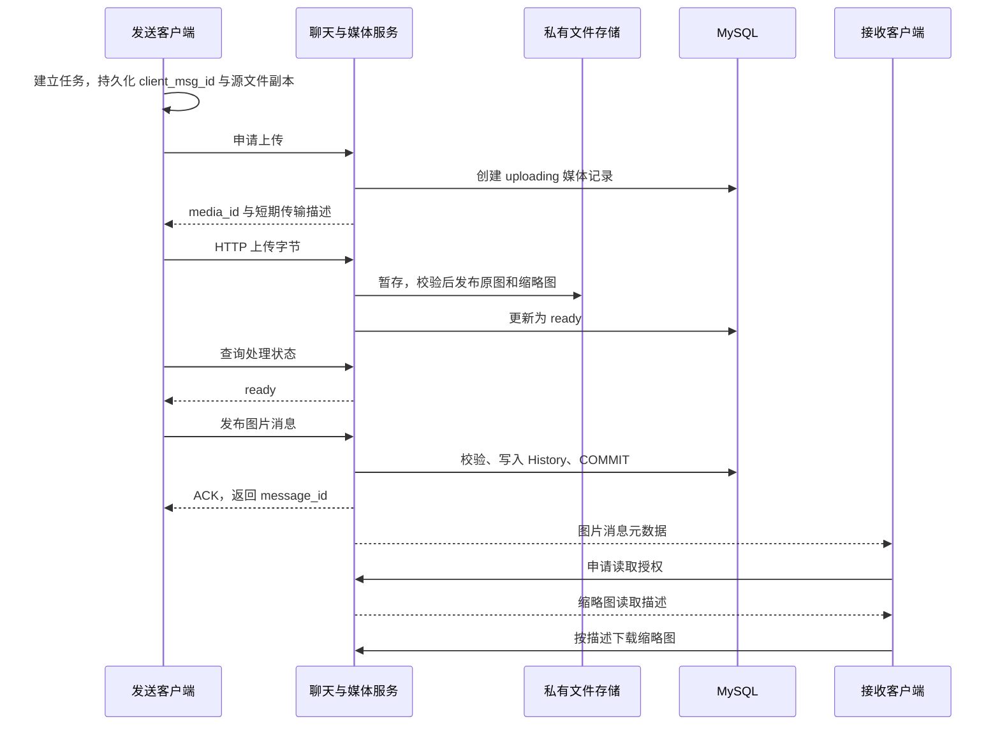

# 第一轮：一次图片发送的身份、时序与状态

本轮目标：能解释上传、处理、消息提交、接收之间的关系，并能沿现有代码定位幂等处理。本文描述目标网络链路；当前图片核心和仓储已实现，图片 TCP/HTTP 接口与 Electron 界面仍待接入。

## 1. 从一张图片开始

设 A 向 B 发送一张照片。客户端先创建一个发送任务，保存源文件副本及稳定的 client_msg_id，然后申请上传。服务端从已登录 session 确定 A 的身份，检查 A 是否有权向该会话发送，再创建媒体记录、分配 media_id 和传输凭据。

HTTP 负责传输文件字节。服务端检查实际字节数、摘要、格式和像素，保存原图与缩略图，将媒体标记为 ready。客户端随后发布引用该媒体的消息。消息事务提交成功后，服务端才返回成功 ACK；接收方得到元数据，再按权限加载图片。

最后两步是磁盘 HTTP 方案的表现；OSS 阶段，字节传输目标可以是 OSS。对象访问仍须经过业务授权。

图中 ACK 和实时投递展示正常路径，二者不可能和数据库提交组成一个跨网络原子操作。实际实现还须处理提交成功但 ACK 或实时通知未送达的问题，持久历史不能依赖通知成功才成立。

## 2. 三个 ID 各自识别什么

下文 C1、M1、R1 为便于阅读的符号；当前仓储要求 client_msg_id 为 36 字符 UUID 形式、media_id 为 32 字符小写十六进制。request_id 的协议尚待实现。

| 标识 | 创建方 | 生命周期 | 重试规则 |
|---|---|---|---|
| request_id | 发起请求的一端 | 一次请求及其回应 | 每次独立尝试使用新的值；回应原样带回 |
| client_msg_id | 发送客户端 | 一次逻辑发送，跨网络重试和客户端重启 | 同一次发送保持不变；用户主动再发一次则新建 |
| media_id | 服务端 | 一个媒体记录及其原图、缩略图 | 查询或重试既有媒体时沿用；它不是文件内容哈希 |

另有 message_id：History 入库后的稳定记录 ID，用于历史定位、展示去重和分页。项目既有字段 `msgid` 表示 LoginMsg 等**协议消息类型**，与 message_id 不是同一个概念。

现有 [tcp.js](E:/chat_server_qt/ChatClient/chat_client_electron/src/tcp.js:124) 仅按回应类型匹配等待者。若同时发出两次相同类型请求，两个等待者可能被第一个回应同时满足。request_id 用于区分这些并发调用，不能用消息类型替代。

本版本媒体与一次发送绑定：Media 的 `(owner_id, client_msg_id)` 唯一，History 的 media_id 也唯一。相同照片主动发送两次，会有两次发送身份和两个媒体记录；内容去重、跨消息复用文件属于另外的存储设计。

## 3. 服务端 ready 不等于客户端已发送

| 位置 | 正常状态推进 | 状态回答的问题 |
|---|---|---|
| Media 记录，已有实现 | uploading → processing → ready | 文件是否具备发布为图片消息的条件？ |
| 客户端任务，待实现 | 准备 → 上传 → 等待处理 → 等待消息确认 → 已发送 | 用户这次发送推进到哪一步？ |
| History 记录，已有仓储 | 事务提交前不存在，提交后成为持久消息 | 这条消息是否已经进入会话历史？ |

Media 还存在 failed 和 canceled 分支。消息发布后 Media 仍可保持 ready；不是把 Media.state 改成 sent。不同状态描述不同对象，不能混用。

上传进度到 100% 只说明传输层的进度已完成；服务端可能还在处理。只有准备好的媒体才可发布；客户端只有获得已提交消息的确认结果，才能确定这次发送成功。等待超时表示结果未知，不足以证明服务端没有提交。

## 4. 用 ACK 丢失看清幂等

一次正常尝试：`request_id=R3, client_msg_id=C1, media_id=M1`。

1. 服务端已经写入 History，得到 message_id=812，并 COMMIT。
2. 连接断开，客户端没有收到 ACK。
3. 客户端重连后以 `R4, C1, M1` 再次请求发布。
4. 服务端找到同一发送者的 C1，核对绑定媒体仍是 M1，返回原 message_id=812，不再次插入。

已有 [publish](D:/chat_server/ChatServer/src/server/db/media_repository.cpp:232) 的关键顺序：权限检查 → 锁定本人媒体记录 → 核对会话和 client_msg_id → 查询已提交消息并处理重试 → 验证 ready/未过期 → 插入并读取消息。外层 [Transaction](D:/chat_server/ChatServer/src/server/db/media_repository.cpp:54) 执行 COMMIT 后才向调用方返回。

在当前实现中，复用 M1 却更换 client_msg_id，会被媒体绑定校验拒绝；重新创建整套发送身份，则表示另一条逻辑消息。真正的重试必须保留原身份。

[SQL 唯一约束](D:/chat_server/ChatServer/migrations/001_chat_media.sql:56) 是最后一道约束，和事务、锁及参数一致性校验共同保证并发正确性。仅在界面上禁用发送按钮不能替代这些条件。

代码已验证的幂等不等于端到端 ACK 丢失已经验收。[仓储测试](D:/chat_server/ChatServer/tests/media_repository_test.cpp:122) 验证重复 publish 返回相同 message_id；网络断开、TCP 回应关联及客户端恢复，还需在后续接线后验证。

## 5. 本轮阅读与练习

阅读顺序：先看 [UploadIntent 和 MediaRepository 接口](D:/chat_server/ChatServer/include/server/media_repository.hpp:28)，再看 publish 中 existing 分支及 Transaction，最后对照仓储重试用例。先理解业务顺序，再进入 Query/Execute 的 Boost.MySQL 实现细节。

练习场景：服务端已经生成缩略图并把 Media 标记为 ready，客户端还没请求 publish 就退出了。请分别判断：Media、History、B 的聊天界面应是什么状态；A 重新登录后，应先查询什么，再决定执行哪一步？

本轮完成标准：能够解释为什么一次上传成功不意味着 B 已收到消息，并能指出 ACK 丢失后需要保留哪些身份、从哪个数据库事实恢复判断。
